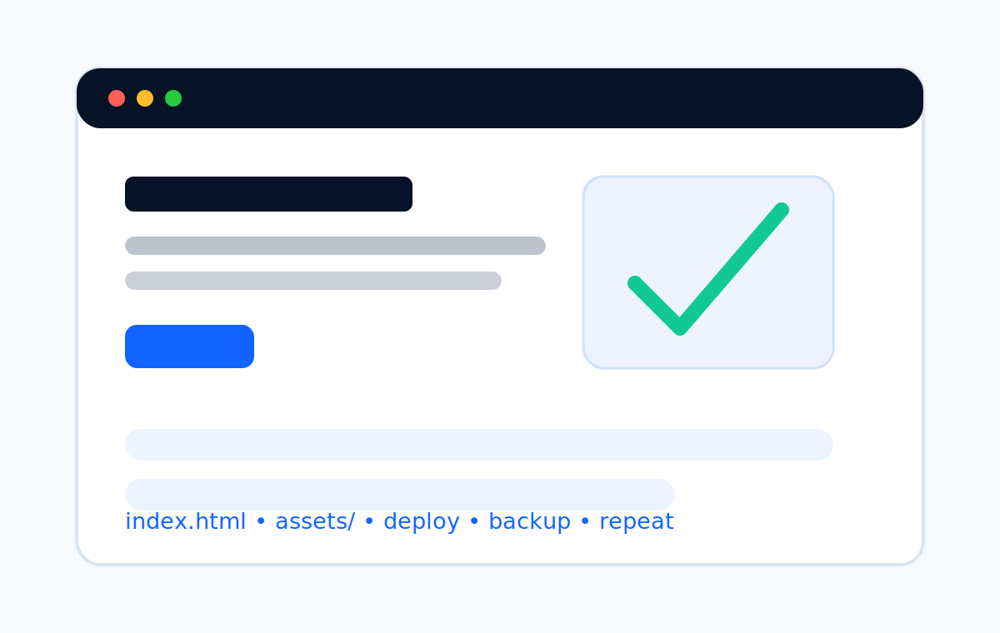
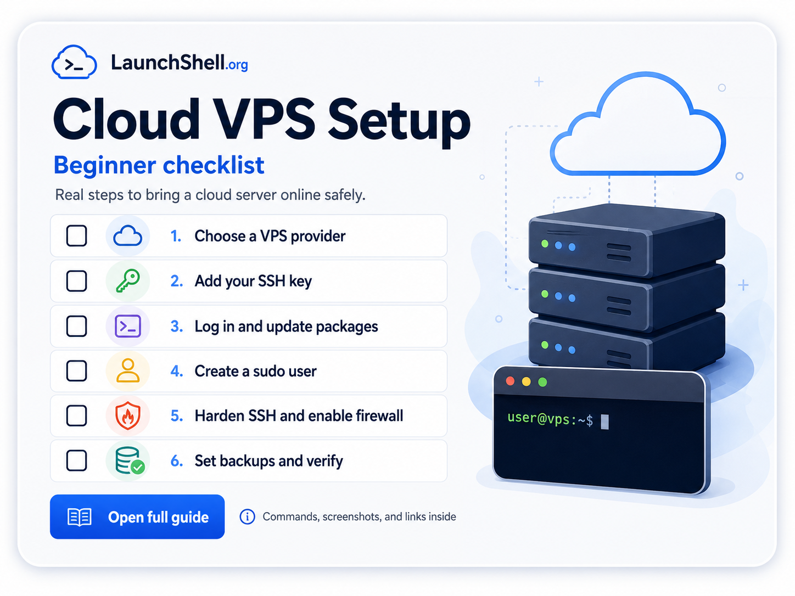
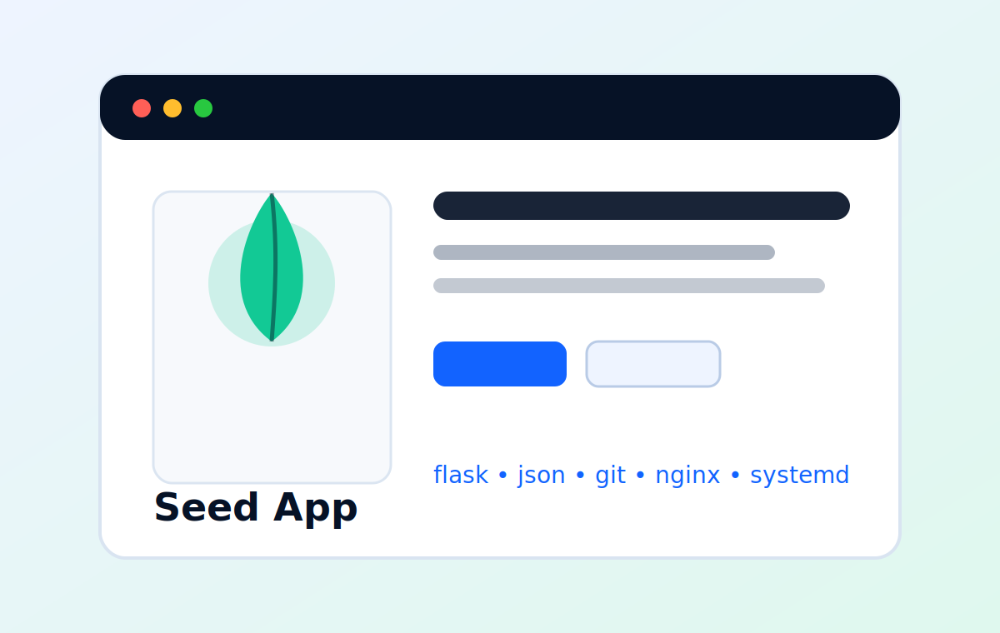
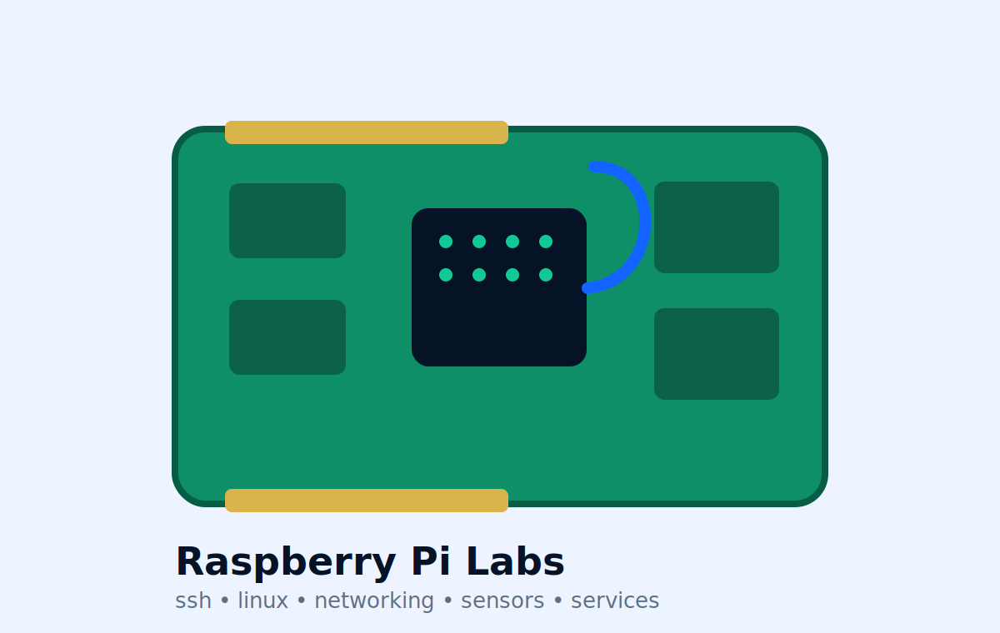
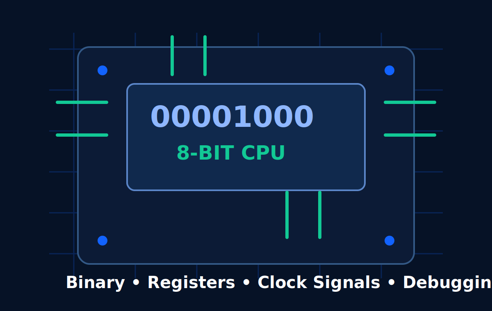
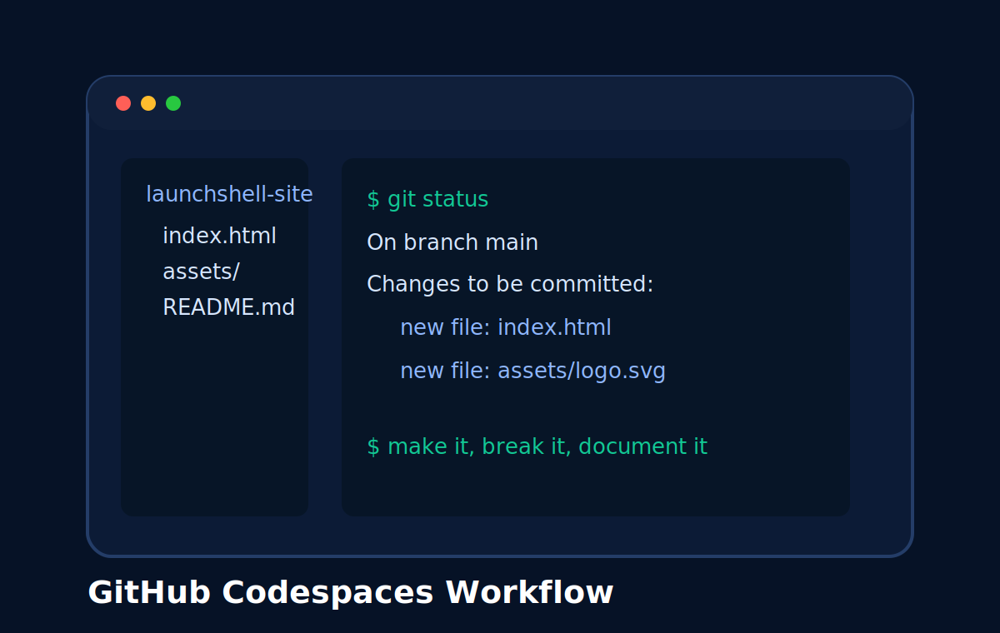

<p align="center">
  
</p>

<p align="center">
  <strong>Build it. Back it up. Break it. Fix it. Learn why.</strong>
</p>

<p align="center">
  A project portfolio and tutorial site for practical technology builds.
</p>

## About

LaunchShell is a project portfolio and tutorial site for documenting real builds, experiments, notes, and lessons from working with Linux, cloud hosting, web servers, electronics, and safe cybersecurity fundamentals.

The site is currently a coming-soon homepage. As it grows, it will collect project writeups, setup notes, troubleshooting logs, and tutorials built around the same practical loop:

1. Build something real.
2. Back it up before changing or stress-testing it.
3. Break or stress-test it safely.
4. Fix what broke.
5. Learn how it actually works.

## Project Areas

| Area | Focus |
| --- | --- |
|  | LaunchShell itself: static site work, GitHub workflow, and Cloudflare Pages deployment. |
|  | VPS web servers, Linux administration, DNS, HTTPS, services, and logs. |
|  | Small personal web apps that solve real tracking and planning problems. |
|  | Raspberry Pi labs, networking, sensors, services, and local hardware projects. |
|  | Electronics and low-level computing projects. |
|  | GitHub Codespaces and repeatable development environments. |

## Current Status

Coming-soon homepage.

## Tech Stack

This is intentionally simple static web work:

- `index.html`
- local SVG assets in `assets/`
- no framework
- no build tools
- no backend
- no package manager

## Deployment

Deployment target: Cloudflare Pages.

Cloudflare Pages can serve this repository directly because `index.html` is at the repository root and assets are stored in `assets/`.

## Basic Edit Workflow

Edit `index.html`, then commit and push:

```sh
git add .
git commit -m "Update LaunchShell homepage"
git push
