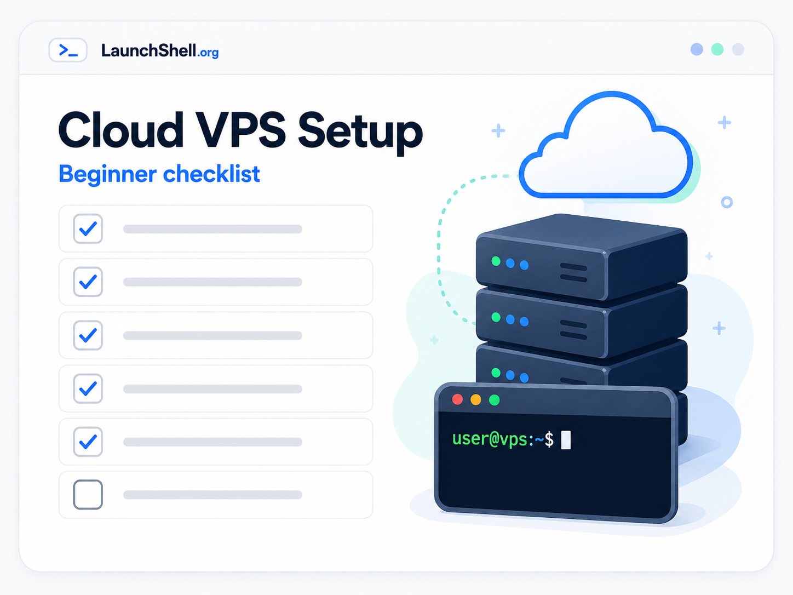
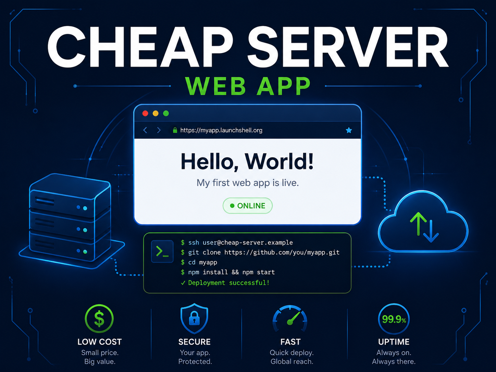
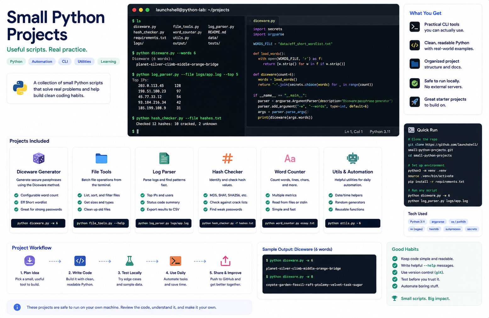
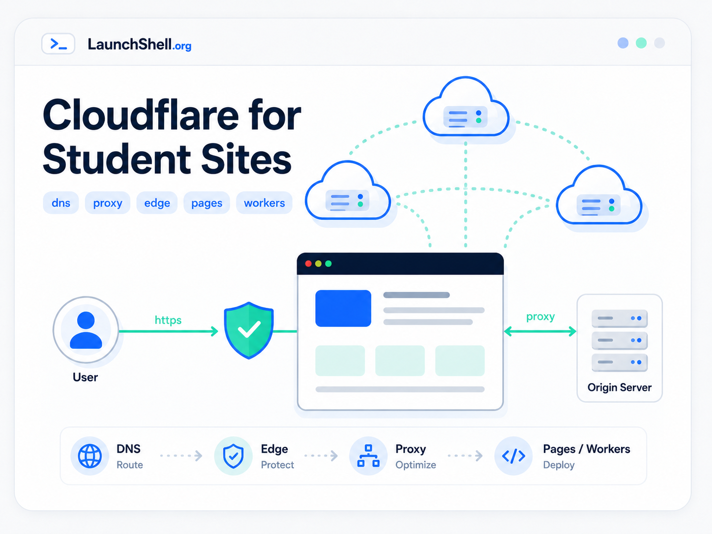
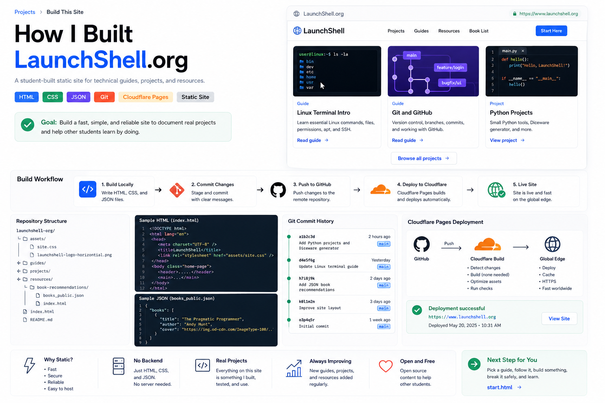
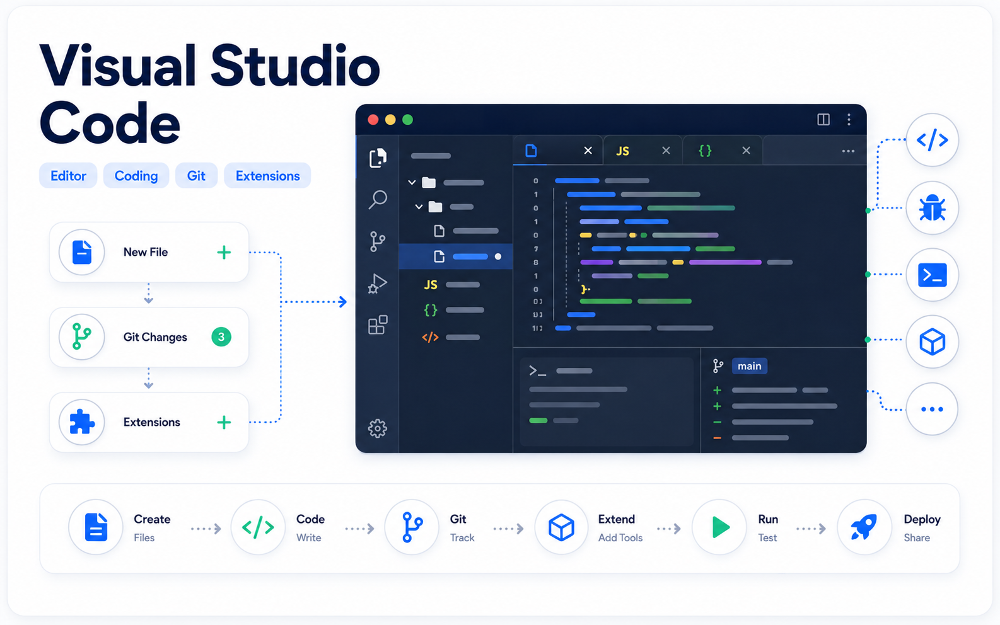
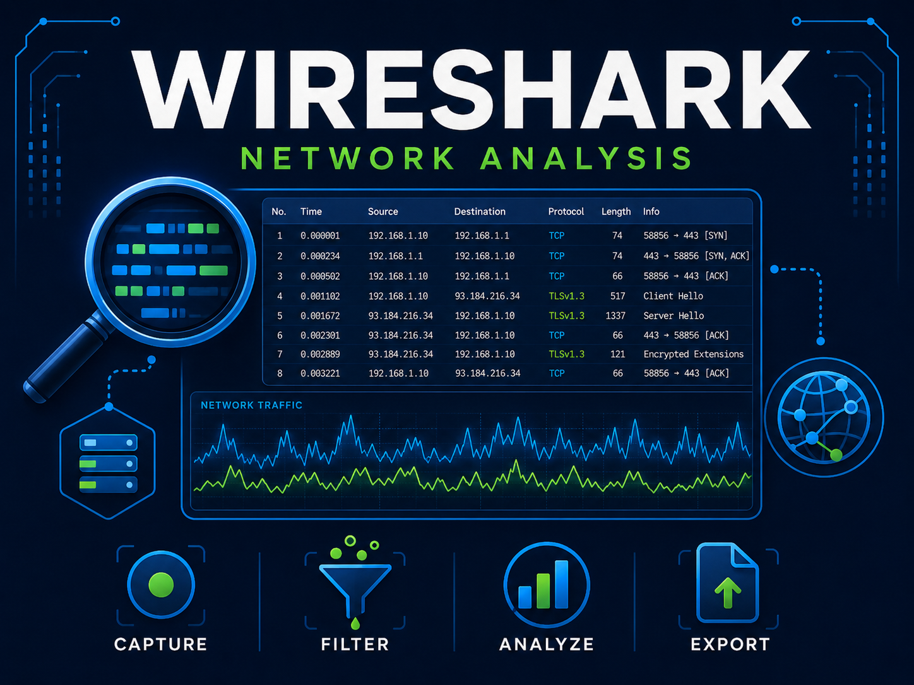
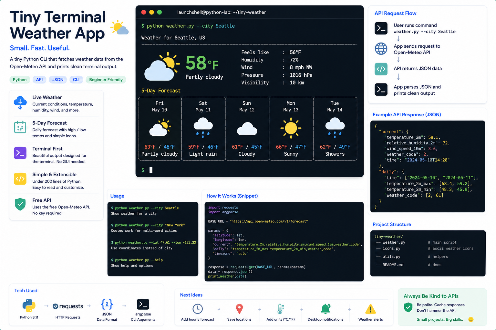

# LaunchShell

<p align="center">
  
</p>

**Build. Launch. Repeat.**

[LaunchShell.org](https://www.launchshell.org/) is a student-built technical portfolio and learning site. It documents practical work with Linux, cloud servers, Git/GitHub, VS Code, Python, Java, web apps, electronics, virtual machines, public resources, networking, APIs, packet analysis, and safe beginner cybersecurity labs.

The site is intentionally simple: plain HTML, shared CSS, local assets, small JavaScript helpers, JSON data files, and static hosting through Cloudflare Pages. There is no framework, backend, package manager, or build step.

## Live Site

- [Homepage](https://www.launchshell.org/) — main project entry point
- [Guides](https://www.launchshell.org/guides/) — beginner-friendly technical guides
- [Projects](https://www.launchshell.org/projects/) — portfolio project writeups
- [Resources](https://www.launchshell.org/resources/) — student tools and learning resources
- [Top 30 Book Recommendations](https://www.launchshell.org/resources/book-recommendations/) — curated reading list backed by JSON

## What It Shows

LaunchShell is meant to show real project work, not a polished fake demo. The site highlights:

- static web fundamentals with HTML, CSS, assets, links, and page structure
- beginner Linux, Git, GitHub, Cloudflare, VPS, and VM workflows
- practical project documentation for Flask apps, Python tools, Java CLI work, honeynet labs, packet captures, and hardware work
- electronics and IoT learning through Arduino, ESP32, Raspberry Pi, MQTT, sensors, and physical computing projects
- public-resource pages for students, including Libby and free or low-cost technical learning tools
- lightweight JSON-backed content patterns for cards, books, and static data
- safe publishing habits: no credentials, private logs, sensitive IPs, or unrevised class material

## Preview

<p>
  
  
  
</p>

<p>
  
  
  
</p>

<p>
  
  
  
</p>

## Main Content

### Guides

- [Linux Terminal Intro](https://www.launchshell.org/guides/linux-terminal-intro/)
- [AWS Free VPS Setup](https://www.launchshell.org/guides/aws-free-vps/)
- [Termius Mobile SSH](https://www.launchshell.org/guides/terminus-mobile-ssh/)
- [What Is a VM?](https://www.launchshell.org/guides/what-is-a-vm/)
- [What Is Hacking?](https://www.launchshell.org/guides/what-is-hacking/)
- [Git and GitHub](https://www.launchshell.org/guides/git-and-github/)
- [GitHub Codespaces](https://www.launchshell.org/guides/github-codespace/)
- [Visual Studio Code](https://www.launchshell.org/guides/vs-code/)
- [Use Libby With Your Library](https://www.launchshell.org/guides/libby/)
- [Cloudflare Pages](https://www.launchshell.org/guides/cloudflare/)
- [Nmap Recon Guide](https://www.launchshell.org/guides/nmap/)
- [Wireshark Packet Analysis](https://www.launchshell.org/guides/wireshark/)
- [Advanced Wireshark](https://www.launchshell.org/guides/advanced-wireshark/)
- [What Is an API?](https://www.launchshell.org/guides/apis/)
- [Arduino and ESP32 Overview](https://www.launchshell.org/guides/arduino-esp32-overview/)
- [IT and Cybersecurity Certifications](https://www.launchshell.org/guides/certification/)

### Projects

- [Build and Deploy a Flask JSON App](https://www.launchshell.org/projects/cheap-server-web-app/)
- [Small Python Projects and Diceware](https://www.launchshell.org/projects/python/)
- [Tiny Terminal Weather App](https://www.launchshell.org/projects/tiny-terminal-weather/)
- [Tiny Terminal Weather App 2.0](https://www.launchshell.org/projects/tiny-terminal-weather-2.0/)
- [T-Pot Honeynet Project](https://www.launchshell.org/projects/tpot-honeynet/)
- [8-Bit Computer and ROM Tooling](https://www.launchshell.org/projects/8-bit/)
- [Raspberry Pi + Alfa Wi-Fi Sniffer](https://www.launchshell.org/projects/raspi-wifi-sniffer/)
- [Solar ESP32 MQTT Sensor](https://www.launchshell.org/projects/solar-esp32-mqtt-sensor/)
- [Java Movie CLI](https://www.launchshell.org/projects/java-movie-cli/)
- [Java Radix Sort for IP Addresses](https://www.launchshell.org/projects/java-radix-ip-sort/)
- [JSON Book Recommendations](https://www.launchshell.org/projects/json-book-recommendation/)
- [How I Built LaunchShell.org](https://www.launchshell.org/projects/build-this-site/)

### Resources

- [Student Resources](https://www.launchshell.org/resources/)
- [Top 30 Book Recommendations](https://www.launchshell.org/resources/book-recommendations/)
- `resources/book-recommendations/books_public.json` powers the book list

## Homepage Card System

The homepage originally hardcoded every card directly into `index.html`. That worked when the site was small, but the homepage became harder to maintain as LaunchShell grew past 25 card images, guides, projects, resources, and repeated links.

The homepage now uses a small JSON-backed card system:

- `data/site-index.json` stores card data such as title, type, level, time estimate, category, summary, URL, image, and homepage section.
- `assets/home-cards.js` loads the JSON file and renders cards into homepage sections.
- `index.html` keeps the page structure clean with section containers such as `data-card-section="start-here"`, `data-card-section="featured-guides"`, `data-card-section="featured-projects"`, and `data-card-section="resources-preview"`.
- `assets/site.css` styles the reusable card layout, metadata chips, and equal-height homepage cards.

This keeps the homepage focused on layout and storytelling while the repeated card content lives in one structured data file.

Example card record:

```json
{
  "id": "linux-terminal-intro",
  "title": "Linux Terminal Intro",
  "type": "Guide",
  "level": "Beginner",
  "time": "30-45 min",
  "category": "Linux",
  "summary": "Learn basic commands, files, folders, apt installs, SSH, and why Linux tools are useful.",
  "url": "guides/linux-terminal-intro/",
  "image": "assets/card-linux-terminal-intro.png",
  "homeSection": "start-here",
  "featured": true
}