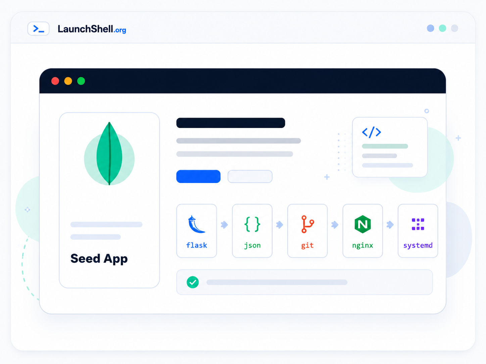

# LaunchShell

<p align="center">
  
</p>

**Build. Launch. Repeat.**

[LaunchShell.org](https://www.launchshell.org/) is a student-built technical portfolio and learning site. It documents practical work with Linux, cloud servers, Git/GitHub, Python, web apps, electronics, virtual machines, public resources, and safe beginner cybersecurity labs.

The site is intentionally simple: plain HTML, shared CSS, local assets, and static hosting through Cloudflare Pages. There is no framework, backend, package manager, or build step.

## Live Site

- [Homepage](https://www.launchshell.org/) — main project entry point
- [Guides](https://www.launchshell.org/guides/) — beginner-friendly technical guides
- [Projects](https://www.launchshell.org/projects/) — portfolio project writeups
- [Resources](https://www.launchshell.org/resources/) — student tools and learning resources
- [Top 30 Book Recommendations](https://www.launchshell.org/resources/book-recommendations/) — curated reading list backed by JSON

## What It Shows

LaunchShell is meant to show real project work, not a polished fake demo. The site highlights:

- static web fundamentals with HTML, CSS, assets, links, and page structure
- beginner Linux, Git, GitHub, Cloudflare, VPS, and VM workflows
- practical project documentation for Flask apps, Python tools, honeynet labs, and hardware work
- public-resource pages for students, including Libby and free or low-cost technical learning tools
- safe publishing habits: no credentials, private logs, sensitive IPs, or unrevised class material

## Preview

<p>
  
  
  
</p>

<p>
  
  
  
</p>

## Main Content

### Guides

- [Linux Terminal Intro](https://www.launchshell.org/guides/linux-terminal-intro/)
- [AWS Free VPS Setup](https://www.launchshell.org/guides/aws-free-vps/)
- [What Is a VM?](https://www.launchshell.org/guides/what-is-a-vm/)
- [What Is Hacking?](https://www.launchshell.org/guides/what-is-hacking/)
- [Git and GitHub](https://www.launchshell.org/guides/git-and-github/)
- [GitHub Codespaces](https://www.launchshell.org/guides/github-codespace/)
- [Use Libby With Your Library](https://www.launchshell.org/guides/libby/)
- [Cloudflare Pages](https://www.launchshell.org/guides/cloudflare/)
- [IT and Cybersecurity Certifications](https://www.launchshell.org/guides/certification/)

### Projects

- [Build and Deploy a Flask JSON App](https://www.launchshell.org/projects/cheap-server-web-app/)
- [Small Python Projects and Diceware](https://www.launchshell.org/projects/python/)
- [T-Pot Honeynet Project](https://www.launchshell.org/projects/tpot-honeynet/)
- [8-Bit Computer and ROM Tooling](https://www.launchshell.org/projects/8-bit/)
- [JSON Book Recommendations](https://www.launchshell.org/projects/json-book-recommendation/)
- [How I Built LaunchShell.org](https://www.launchshell.org/projects/build-this-site/)

### Resources

- [Student Resources](https://www.launchshell.org/resources/)
- [Top 30 Book Recommendations](https://www.launchshell.org/resources/book-recommendations/)
- `resources/book-recommendations/books_public.json` powers the book list

## Tech Stack

- HTML
- CSS
- local images and icons
- JSON for simple static data
- Git and GitHub for version control
- Cloudflare Pages for hosting

## Repository Structure

```text
.
├── assets/
│   ├── site.css
│   ├── card-*.png
│   └── shared images and icons
├── guides/
│   ├── aws-free-vps/
│   ├── certification/
│   ├── cloudflare/
│   ├── git-and-github/
│   ├── github-codespace/
│   ├── libby/
│   ├── linux-terminal-intro/
│   ├── what-is-a-vm/
│   └── what-is-hacking/
├── projects/
│   ├── 8-bit/
│   ├── build-this-site/
│   ├── cheap-server-web-app/
│   ├── json-book-recommendation/
│   ├── python/
│   └── tpot-honeynet/
├── resources/
│   ├── book-recommendations/
│   │   ├── books_public.json
│   │   └── index.html
│   └── index.html
├── index.html
└── README.md
```

## Local Preview

Because this is a static site, it can be opened directly in a browser. For a closer local preview, serve the folder:

```sh
cd sites/launchshell-org
python3 -m http.server 8000
```

Then open:

```text
http://localhost:8000/
```

## Deployment

The deployment target is [Cloudflare Pages](https://www.launchshell.org/guides/cloudflare/). Cloudflare Pages can serve this repository directly because the root page is `index.html` and all pages, JSON files, images, and CSS are committed.

The normal publishing workflow is:

```sh
git status --short
git diff --check
git add <files>
git commit -m "Describe the site update"
git push
```

## Publishing Rule

LaunchShell is public. Before pushing, review changes for:

- credentials, API keys, SSH keys, tokens, or passwords
- private logs, screenshots, IPs, hostnames, or account details
- unrevised class/work material that should not be public
- broken relative links or missing assets

The goal is to show real project work, clear learning paths, and useful public documentation without publishing sensitive details.
